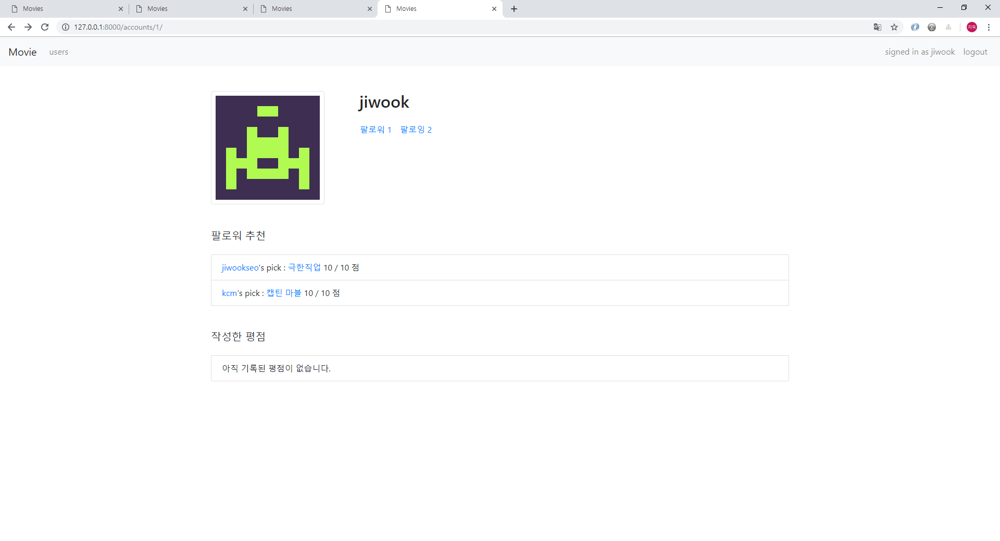

# Django M:N Movie Project

## I. 목표

- 데이터베이스 모델링
- 알고리즘을 적용한 웹 프로젝트
- 커스텀 탬플릿 필터, gavatar 적용

## II. 과정

## 1. Models

* `accounts/User`

  1. 팔로우 M:N 관계를 위한 `ManyToManyField` 설정

  2. 작성한 평점들의 평균을 구하는 `get_score` method 추가
  3. 작성한 평점들 중 가장 평점이 높은 `Score` 객체를 반환하는 `get_recommend` method 추가

* `movies/Movie`

  1. 마찬가지로 작성한 평점들의 평균을 구하는 `get_score` method 추가

* `movies/Score`

  | 필드명 | 자료형 | 설명|
  | ----------- | -------- | -------------------------- |
  | id          | Interger | Primary Key                |
  | content | String | 한줄평(평가 내용) |
  | value | Integer | 평점 |
  | movie_id | Integer | Movie의 Primary Key(id 값) |
  | user_id | Integer | User의 Primary Key(id 값) |

  1. 주어진 DB schema 와 같이 생성
  2. value 값을 0~10 사이로 하기 위해 bulit-in validator 사용

## 2. Accounts App

* views

  1. 기본적인 list, detail actions 생성

  2. 팔로우 기능 구현

     ```python
     @login_required
     def follow(request, pk):
         user = get_object_or_404(User, pk=pk)
         if user in request.user.from_user.all():
             request.user.from_user.remove(user)
         elif user != request.user:
             request.user.from_user.add(user)
         return redirect('accounts:detail', pk)
     ```

  3. 팔로워, 팔로잉 유저 목록

      * 팔로워, 팔로잉 유저 보여주기 위해서 해당 query set과 해당하는 title을 template에 전달

      * 이때 list, followe, following 는 모두 동일하게 아래 users template을 사용한다.

        

* templates

  1. `Users.html`

      

      `title` 과 `people` 을 인자로 받아서 제목과 해당 `User` 쿼리셋을 전달받아 출력해준다.

      따라서 동적으로 모든 유저, 팔로워, 팔로잉 유저들을 출력해줄 수 있다.

      이미지로는 email 을 hash로 gravatar를 생성해 출력해주었다.

      * [gravatar 홈페이지 참고](<https://ko.gravatar.com/site/implement/images/django/>), `accounts/templatetags/gravatar.py`

          ```python
          import hashlib
          from urllib.parse import urlencode
          from django import template
          from django.utils.safestring import mark_safe
          
          register = template.Library()
          
          # return only the URL of the gravatar
          # TEMPLATE USE:  {{ email|gravatar_url:150 }}
          @register.filter
          def gravatar_url(email, size=40):
              default = 'retro'
              return "https://www.gravatar.com/avatar/%s?%s" % (
                  hashlib.md5(email.lower().encode('utf-8')).hexdigest(), urlencode({'d': default, 's': str(size)}))
          
          # return an image tag with the gravatar
          # TEMPLATE USE:  {{ email|gravatar:150 }}
          @register.filter
          def gravatar(email, size=40):
              url = gravatar_url(email, size)
              return mark_safe('' % (url, size, size))
          ```

  2. `detail.html`

      

      프로필 페이지 template

      * 팔로워와 팔로잉 유저 목록을 확인할 수 있다.
      * 해당 유저가 작성한 평점을 통해 해당 Movie link로 이동할 수 있다.
      * 본인의 프로필일 경우에만, 팔로워들의 추천 영화를 출력해준다.

      

## 3. Movie App

* views

  1. ModelForm, decolator를 사용해 `Score` 를 create 해준다.

     ```python
     @login_required
     @require_POST
     def new_score(request, pk):
         movie = get_object_or_404(Movie, pk=pk)
         form = ScoreForm(request.POST)
         if form.is_valid():
             score = form.save(commit=False)
             score.user = request.user
             score.movie = movie
             score.save()
         else:
             return render(request, 'movies/detail.html', {'movie': movie, 'form': form})
         return redirect('movies:detail', pk=pk)
     ```

  2. delete도 마찬가지로 decolator를 사용해 작성자와 유저가 같을 경우에만 delete 해준다.

     ```python
     @login_required
     @require_POST
     def delete_score(request, movie_pk, score_pk):
         score = get_object_or_404(Score, pk=score_pk)
         if request.user == score.user:
             score.delete()
         return redirect('movies:detail', pk=movie_pk)
     ```

* templates

  1. `list.html`

     

     * poster 이미지 클릭할 경우 detail 페이지로 갈 수 있도록 한다.

  2. `detail.html`

     

     * 영화 정보를 모두 보여준다.
     * 작성된 평점들을 총 개수, 평균 평점, 세부 목록을 출력해준다.
     * 로그인 해야만 입력 form이 제공되고, 로그인 하지 않으면 로그인 링크를 제공한다.
     * 유저와 작성자가 같을 경우에만 유저 이름 우측에 삭제 버튼을 활성화 시켜준다.