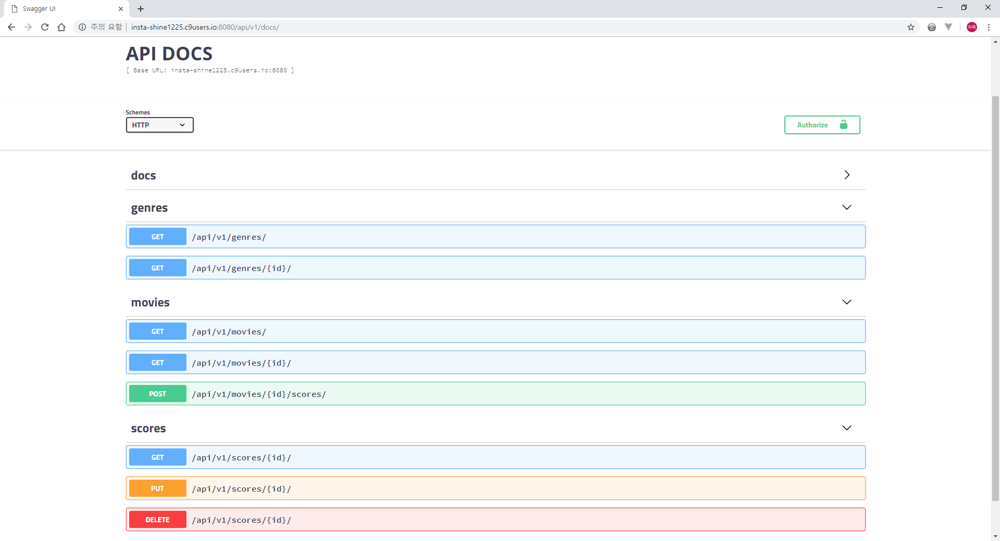

# Django M:N Movie Project

## I. 목표

- RESTful API 서버 구축

## II. 과정

## 1. Models

* 주어진 Schema, fixtures


## 2. Serializers

* `GenreSerializer` 에는 해당 장르의 `Movie` 객체들을 보여줄 수 있도록 `MovieSerializer` 를 이용

    ```python
    class GenreSerializer(serializers.ModelSerializer):
        movies = MovieSerializer(many=True, read_only=True)
        class Meta:
            model = Genre
            fields = (
                'id',
                'movies',
                'name',
            )
    ```

## 3. API View

* 알맞은 HTTP 상태코드와 data json 을 반환해 줄 수 있도록 한다.

  ```python
  @api_view(['GET', 'PUT', 'DELETE']) # api_view decorator > 405 method allow
  def score_detail(request, pk):
      score = get_object_or_404(Score, pk=pk) # get_object_or_404 > 404 not exist
      if request.method == 'GET':
          serializer = ScoreSerializer(score)
          return Response(serializer.data)
      elif request.method == 'PUT':
          serializer = ScoreSerializer(score, data=request.data)
          if serializer.is_valid(raise_exception=True): # raise > 400 Bad Request
              serializer.save()
              return Response({"message": "수정되었습니다."},
                              status=status.HTTP_202_ACCEPTED) # 202 Accepted
      elif request.method == 'DELETE':
          score.delete()
          return Response({"message": "삭제되었습니다."},
                          status=status.HTTP_204_NO_CONTENT) # 204 No content
  ```

## 4. Swagger

DRF-Swagger 를 이용한 Document 생성

