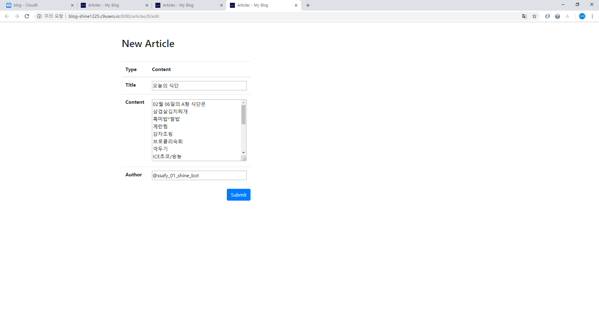

# Simple Blog

- SQLite3 practice by Python, Flask
- Bootstrap practice for blog service


## I. 목표

데이터를 생성, 조회, 삭제, 수정할 수 있는 Web Application 제작

SQLite3를 통한 데이터 조작


## II. 구성

```bash
$ tree
.
|-- README.md
|-- app.py
|-- data
|   |-- blog.db
|   `-- query.sql
|-- static
|   `-- favicon.png
`-- templates
    |-- article.html
    |-- edit.html
    |-- layout.html
    |-- main.html
    `-- new.html
```


## II. 스펙

SQLite3 DB를 이용한 블로그 관리

- article 작성 및 article 리스트 출력 기능  
  : content 입력은 textarea를 사용해 여러 줄로 입력할 수 있도록 한다. 
- article 상세 페이지 기능  
  :  html 출력은 줄바꿈을 지원하지 않음으로 splitlines()과 jinja for문과 br tag를 사용해 줄바꿈 해준다.
- article 수정 및 삭제 기능  
  : primary key를 동적으로 받아 수정 및 삭제 기능을 구현
- 모든 기능은 POST request 방식을 사용해 보안성을 높힌다.
- CREATE, UPDATE 마친 후 해당 article page로 redirect 해준다.
- DELETE 마친 후 해당 main page로 redirect 해준다.


## III. 샘플이미지

- main page :  
  
- article page :  
  
- edit page :  
  