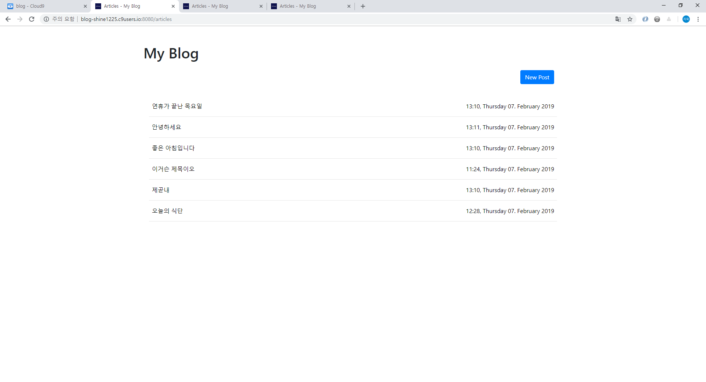
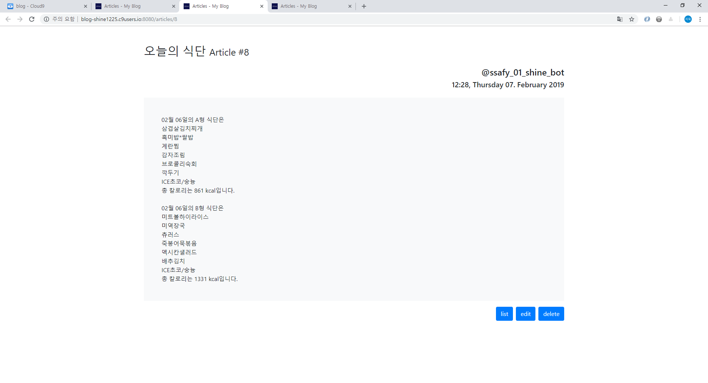

# Simple Blog2 by ORM

- ORM practice by Flask-SQLAlchemy


## I. 목표

데이터를 생성, 조회, 삭제, 수정할 수 있는 Web Application 제작

Flask-SQLAlchemy 을 이용한 ORM DB관리


## II. 구성

```bash
$ tree
.
|-- README.md
|-- app.py
|-- data
|   `-- blog2.db
|-- static
|   `-- favicon.png
`-- templates
    |-- article.html
    |-- edit.html
    |-- layout.html
    |-- main.html
    `-- new.html
```


## II. 스펙

* SQLite3를 이용한 Simple Blog와 동일한 기능을 가진다.  
  : [simple blog link](https://github.com/jiwookseo/web_projects/tree/master/blog)

* 하지만, Flask-SQLAlchemy를 사용한 ORM 버전으로 제작


## III. 샘플이미지

- main page :  
  
- article page :  
  
- edit page :  
  