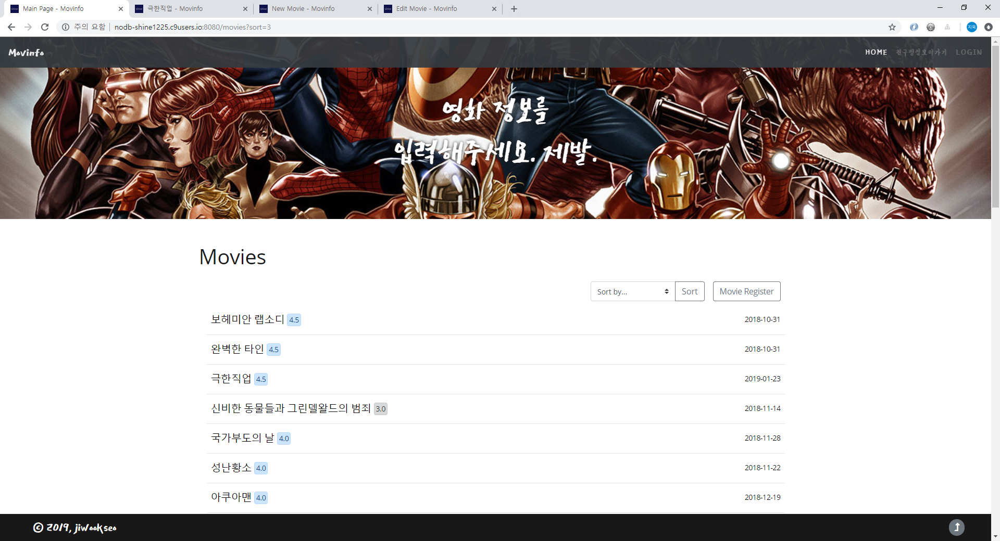
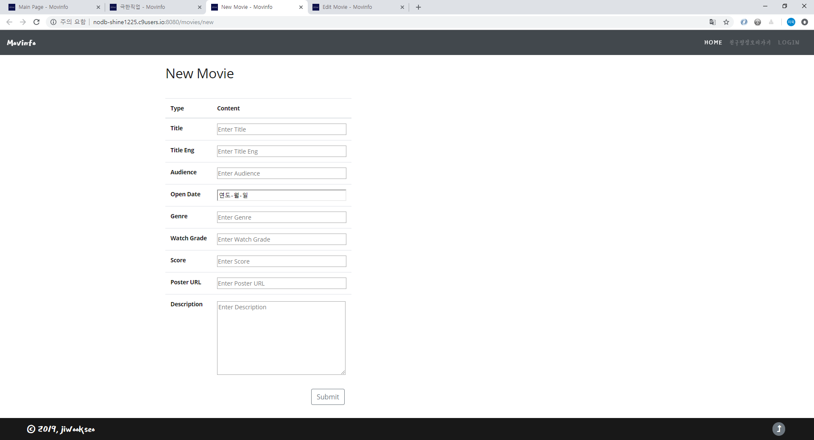
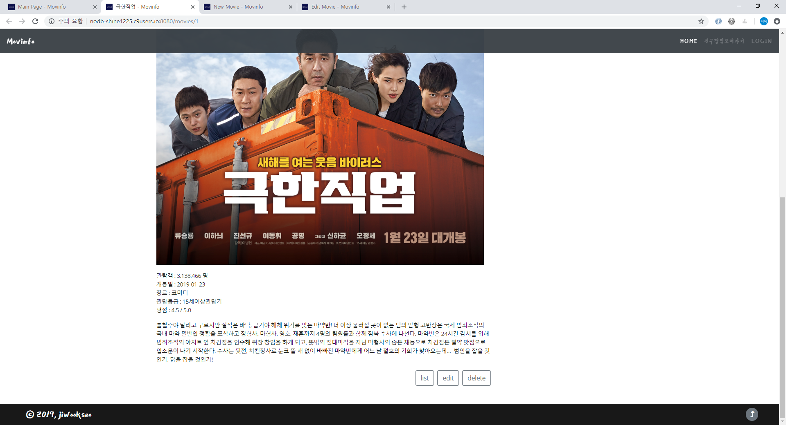
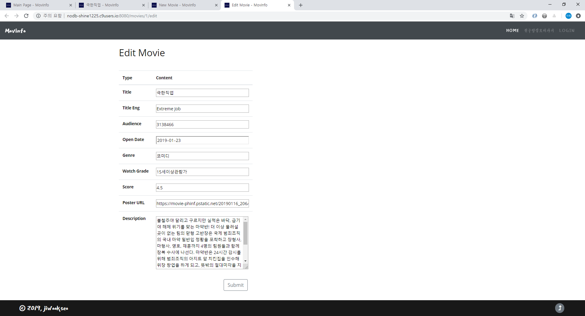

# ORM Project

## I. 목표

- 데이터를 생성, 조회, 삭제, 수정할 수 있는 Web Application 제작
- Python Web Framework를 통한 데이터 조작
- Object Relational Mapping에 대한 이해
- Template Variable을 활용한 Template 제작
- 영화 추천 사이트의 영화 정보 데이터 관리


## II. 구조

```bash
$ tree
.
|-- app.py
|-- save2csv.py
|-- data
|   |-- data.csv
|   `-- movies.db
|-- static
|   `-- css
|   |   `-- style.css
|   `-- favicon.png
`-- templates
    |-- base.html
    |-- edit.html
    |-- index.html
    |-- new.html
    `-- show.html
```

* app.py : Flask App
* data : DB, basic data csv
* static : css, favicon, imgs
* templates : html


## III. 과정

### 1. DB table class create

* Flask-SQLAlchemy를 이용해 db 객체를 생성한다.

* route를 통해 데이터를 생성, 조회, 삭제, 수정할 수 있도록 한다.

* table schema

  | field       | type    | notice                                   |
  | ----------- | ------- | ---------------------------------------- |
  | id          | integer | primary_key                              |
  | title       | text    | unique value, nullable = False           |
  | title_en    | text    | nullable = False                         |
  | audience    | number  | nullable = False                         |
  | open_date   | date    | nullable = False, python datetime object |
  | genre       | text    | nullable = False                         |
  | watch_grade | text    | nullable = False                         |
  | score       | number  | nullable = False, min=0, max=5, step=0.5 |
  | poster_url  | text    | nullable = False                         |
  | description | none    | nullable = False                         |

  

### 2. Data load

`/movies/load` 에 접근해 data.csv에서 소스 데이터를 불러와 DB에 저장한다.


### 3. Route

* index   
    
    1. DB의 데이터를 주어진 정렬 방식대로 불러와 출력해준다.  
        영화 제목과 평점 별로 색상이 동적으로 변경되는 평점 alert, 개봉 일자 출력
    2. sort select tag을 배치해 정렬방식을 바꿀 수 있도록 한다.
        - 박스오피스순
        - 개봉일순
        - 관람객순
        - 유저 평점순
    3. new movie button을 배치해 새로운 영화를 추가할 수 있도록 한다.


* new / create  
    

    1. `movies/new`에서 form을 통해 영화 정보를 입력받아 `movies/create`로 post request 보내준다.  
       * open date의 경우에는 python datetime type으로 parsing 해 저장한다.
    2. 받은 정보로 Movie 객체를 생성해 DB에 추가한다.
    3. 생성된 데이터에 해당하는 상세정보 페이지로 redirect 해준다.

    

* show  
    

    1. pk를 key로 해당하는 영화 정보를 출력해준다.
    2. list 버튼을 배치해 main page로 돌아갈 수 있도록 한다.
    3. edit 버튼을 배치해 `/movies/<int:pk>/edit` 로 이동해 해당하는 레코드를 수정할 수 있도록 한다.
    4. delete 버튼을 배치해 `/movies/<int:pk>/delete`해당하는 레코드를 삭제할 수 있도록 한다.

    

* edit / update  
    

    1. pk를 key로 해당하는 영화 데이터를 불러와 form에 입력해준다.  
       * open date 같은 경우에는 datetime type을 string으로 변경해 입력해준다.
    2. 데이터를 수정한 후 `/movies/<int:pk>/update`에 post request를 보내준다. 
    3. 받은 데이터로 해당하는 영화 정보를 변경해준다.  
       * open date 같은 경우에는 datetime type으로 다시 parsing해 입력해준다.
    4. 해당 데이터의 영화 상세 정보 페이지로 redirect 해준다.


* delete
  1. pk를 key로 해당하는 영화 데이터를 삭제해준다.
  2. main page로 redirect 해준다.


### 4. templates

```bash
$ tree
.
|-- base.html
|-- edit.html
|-- index.html
|-- new.html
`-- show.html
```

앞서 서술한 route에 대응하는 templates

* base.html  
  : head, navbar, footer를 포함한 layout html
* index.html  
  : main page, 영화 목록을 출력해주고, 영화 추가 등록, 영화 목록 정렬 기능
* new.html  
  : 영화 추가 등록 page
* show.html  
  : 영화 상세 정보 page
* edit.html  
  : 영화 정보 수정 page

