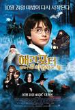
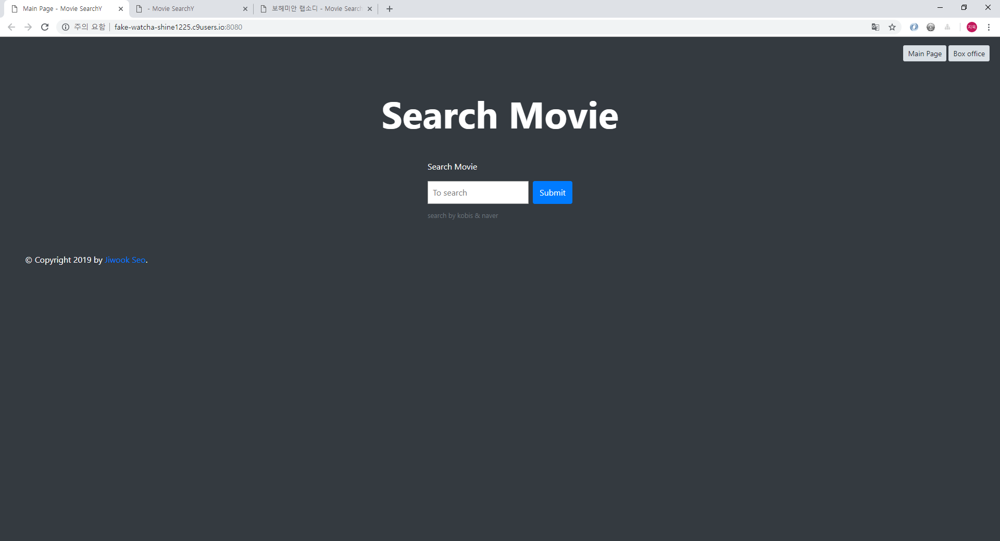
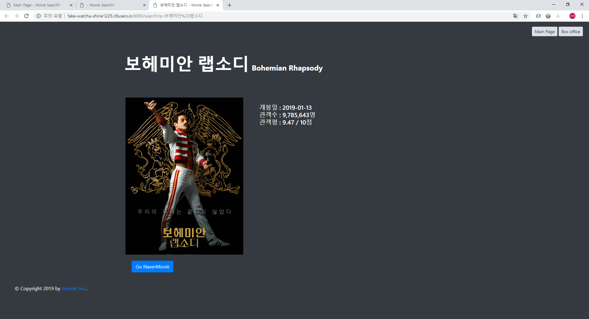
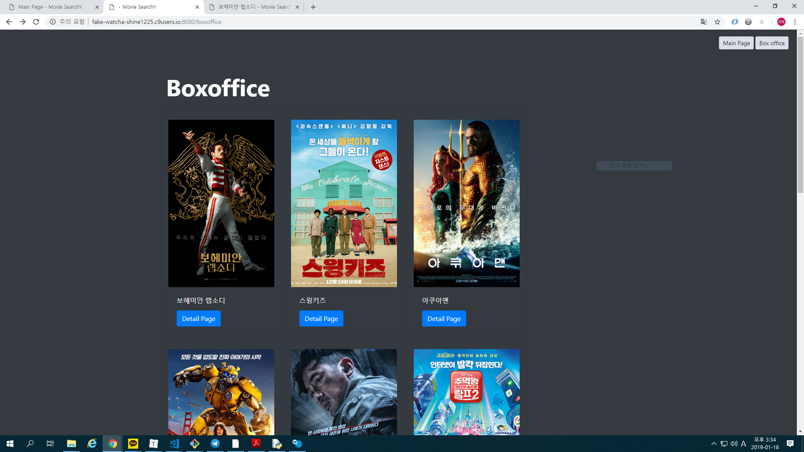

# Fake watcha service

영화진흥위원회 오픈 API와 네이버 영화 검색 API를 이용한 fake-watcha, 영화평점사이트

[source code github repository](https://github.com/jiwookseo/fake_watcha) (private)


## O. 단계

1. 데이터 수집\
   : 영화진흥위원회 API와 네이버 API를 이용해 데이터를 수집해 필요한 형태의 데이터를 가공한다.
2. 데이터 저장\
   : 앞서 가공한 데이터를 csv와 jpg로 각각 저장한다.
3. Web 서비스\
   : 저장한 csv 파일을 이용해 Web에서 영화 검색 기능과 boxoffice 목록 출력 기능을 구현한다.


## I. 데이터 수집

### 영화진흥위원회 오픈 API

영화진흥위원회 API key 정보 headers를 가지는 GET requests를 통해 데이터를 받아온다.

source code 중 **kobisMovie.py module**에 해당된다.

* 주간/주말 박스오피스 데이터 API

   : source code 중 **kobisMovie.boxoffice method**에 해당된다.

   1. parameter로 날짜 정보를 받아서 해당 날짜까지 10주간 주간 데이터를 받아온다.

   2. 데이터에서 필요한 고유코드, 영화제목, 누적관람객수 등을 가공해 list로 반환해준다.

      

* 영화 상세정보 API

   : source code 중 **kobisMovie.info method**에 해당된다.

   1. 위에서 가져온 박스 오피스 데이터, 그 중 movieCd, 고유코드를 이용해 영화별 상세정보를 받아온다.

   2. 받아온 데이터 중 필요한 정보들을 가공해서 list로 반환해준다.\
      예외사항이 발생할 수 있는 배우 항목은 min, len을 이용해 횟수를 제한하여서 받아온다.


### 네이버 검색 API

네이버 API app id와 key를 headers로 가지는 POST requests를 통해 데이터를 받아온다.

source code 중 **naverMovie.py module**에 해당된다.

* 네이버 영화 검색 API\
  : source code 중 **naverMovie.info method**에 해당된다.

  1. 앞서 영화진흥위원회 API를 통해 가져온 영화이름 데이터를 이용해 영화 정보를 받아온다.

  2. 받아온 데이터 중 포스터 썸네일 링크, 유저평점, 네이버 영화 링크를 받아오고

     **추가로,** 포스터 원본 이미지를 가져오기 위해 원본 이미지가 팝업되는 url를 받아온다.

  3. 받아온 원본 이미지 팝업 url 에서 bs4를 이용해 원본 이미지 url을 scraping 한다.

  4. 받아온 데이터를 list로 반환해준다.


## II. 데이터 저장

### CSV save & load

앞서 list 형태로 가공한 데이터를 csv module을 통해 csv 파일로 저장하고, 또한 불러온다.

source code 중 **save2csv.py module**에 해당한다.


### 이미지 다운로드

네이버 API를 통해 받아온 썸네일 이미지와 원본 이미지를 shutil module을 이용해 다운로드 한다.

편의상 naverMovie.py module 에 포함하였다. **naverMoive.down_images** method에 해당된다.


## III. 데이터 수집 및 저장 과정 예시

실제로 데이터를 수집하고 저장하는 과정 예시

source code 중 **test.py**에 해당된다.


* kobisMovie 데이터 수집 및 저장 과정

  1. 데이터 수집 및 저장

      ```python
      k=kobisMovie(key)
      data=k.boxoffice(2019,1,13)
      save_csv("boxoffice.csv",data)
      data=k.info(data)
      save_csv("movie.csv",data)
      ```

  2. boxoffice.csv 예시\
      고유코드와 제목, 관람객수, 기준일을 저장한다.

      ```
      movie_code,title,audience,recorded_at
      20177538,완벽한 타인,5270621,20181216
      ```

  3. movie.csv 예시\
      고유코드, 국문제목, 영문제목, 원문제목, 제작년도 등을 저장한다.\
      앞서 서술한 것 처럼 장르, 배우는 case 마다 개수가 다르기에 join와 min, len등을 적절히 써 저장한다.

      ```
      movie_code,movie_name_ko,movie_name_en,movie_name_og,prdt_year,genres,directors,watch_grade_nm,actor1,actor2,actor1
      20177538,완벽한 타인,Intimate Strangers,,2018,115,드라마/코미디,이재규,15세이상관람가,유해진,조진웅,이서진
      ```

  

* naverMovie 데이터 수집 및 저장 과정

  1. 데이터 수집 및 저장

     ```python
     n=naverMovie(client,secret)
     data=n.info(data)
     save_csv("movie_naver.csv",data)
     n.down_images(data,"images/")
     ```

  2. movie_naver.csv 예시\
     고유코드와 썸네일 이미지 링크, 네이버 영화 링크, 유저 평점, 원본 이미지 링크를 저장한다.

     ```
     movie_code,thumb_url,link_url,user_rating,origin_url
     20177538,https://ssl.pstatic.net/imgmovie/mdi/mit110/1676/167638_P71_133542.jpg,https://movie.naver.com/movie/bi/mi/basic.nhn?code=167638,8.66,https://movie-phinf.pstatic.net/20181106_289/1541478936071tmadh_JPEG/movie_image.jpg
     ```

  3. images 예시

     * 썸네일 이미지\
       

     

     * 원본 이미지\
       


## IV. Web 서비스

c9 Flask app을 생성하여 영화 검색 기능과 boxoffice 출력 기능을 활성화 하였다.

nav bar를 이용해 메인페이지와 boxoffice 페이지로 이동할 수있다.

* main page\
  : 메인페이지에서 영화 제목을 입력하면 해당 영화의 수집한 데이터와 원본 이미지를 보여준다.
  
  

  

* search page\
  : 검색 결과 페이지 예시, 보헤미안 랩소디 검색 결과
  
  


* boxoffice page\
  데이터 기준일인 1월 13일의 boxoffice 1-10위를 보여준다.
  
  


## V. 출처

[영화진흥위원회 API](http://www.kobis.or.kr/kobisopenapi/homepg/apiservice/searchServiceInfo.do)\
[네이버 영화 검색 API](https://developers.naver.com/docs/search/movie/)
