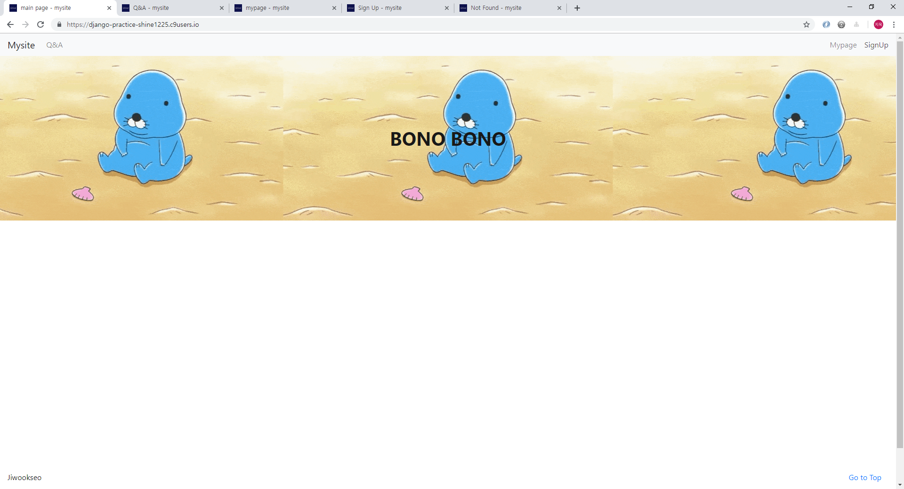
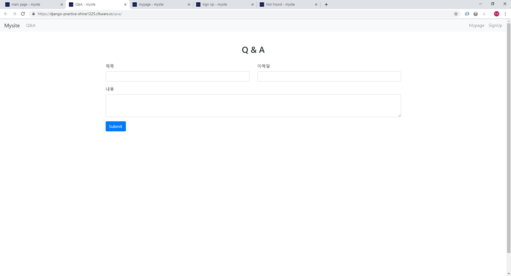
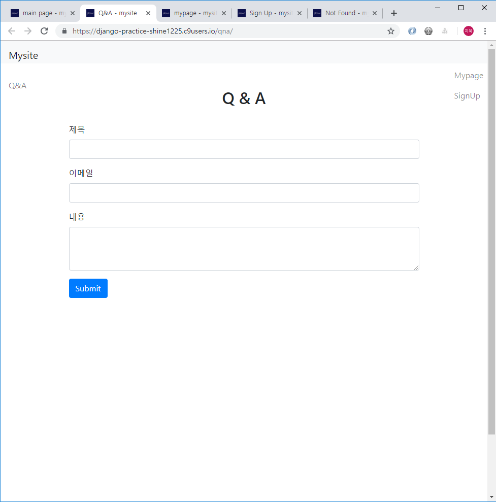
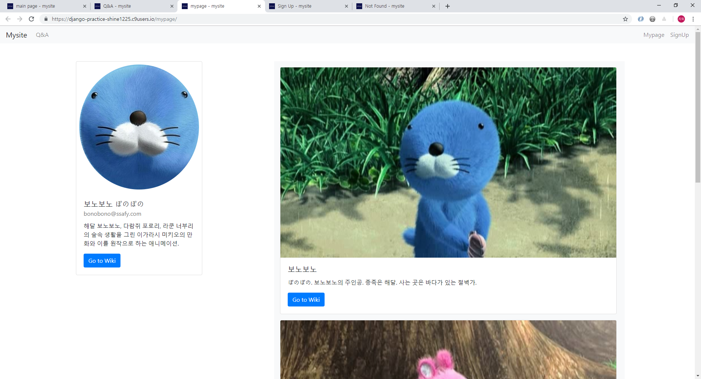
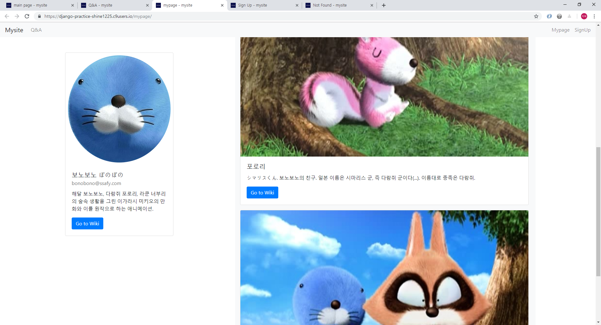
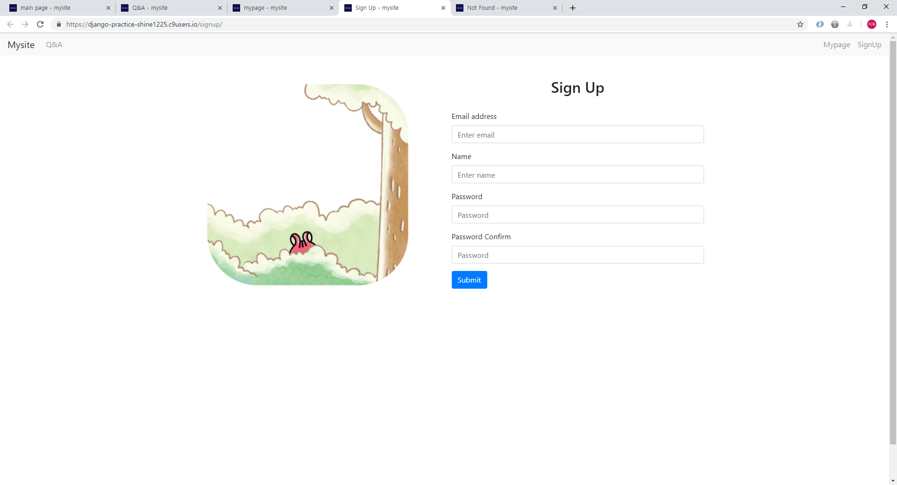
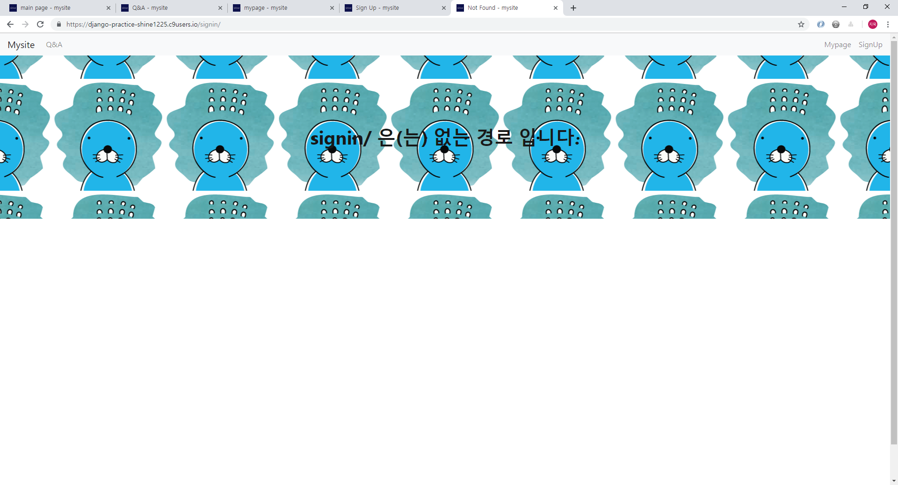

# Django Templates

## I. 목표

* Django Web Framework를 사용한 기초 템플릿 작성


## II. 구조

```bash
$ tree -d
.
|-- detail
|   |-- migrations
|   |-- static
|   |   |-- css
|   |   `-- image
|   `-- templates
`-- mysite
```

- `mysite` : Django project
  - `urls.py` : routing
- `detail` : Django App
  - `static` : css, favicon, imgs
  - `templates` : htmls
  - `views.py` : controller


## III. 과정

### 1. Django Setting

* Django Project 생성
* Django App 생성


### 2. Views

```python
from django.shortcuts import render

def index(request):
    return render(request,'index.html')
    
def qna(request):
    return render(request,'qna.html')
    
def mypage(request):
	# articles = data
    return render(request,'mypage.html',{'articles':articles})
    
def signup(request):
    return render(request,'signup.html')
    
def notfound(request,not_found):
    return render(request,'notfound.html',{'not_found':not_found})
```

1. `mypage/` route는 저장된 articles를 template에 인자로 보내준다.

2. 이외의 route는 특별한 처리 없이 template로 연결한다.
3. 지정되지 않은 route에는 notfound function을 연결해 에러 메세지를 낼 수 있도록 한다.


### 3. Templates

* `base.html`

  모든 template에 extends되는 layout template

  1. css, favicon, bootstrap setting을 해준다.
  2. 해당하는 route로 이동시켜주는 Navbar를 만들어 스크롤에 관계 없이 Body 최상단에 위치하도록 한다.

  

* `index.html`

  

  1. navbar 하단에 배경과 제목을 포함하는  `height: 350px`, `width: 100vw` 크기의 header를 생성한다.
  2. 배경 이미지로는 움직이는 gif를 사용했고, 적절한 크기의 이미지가 없어 cover 대신 여러개를 출력했다.
  3. header title은 flex display를 이용해 가로 세로 중앙정렬한다.
  4. 이름과 최상단 이동 버튼을 포함한 `height: 50px`, `width: 100vw` 크기의 footer를 생성한다.
  5. fixed position을 이용해 스크롤과 관계없이 body 최하단에 위치하도록한다.

  

* `qna.html`

  
  

  1. Q&A input을 받을 수 있는 Form을 생성한다.

  2. device size가 large 미만이 될 때에는 반응형 grid를 사용해 1줄에 1가지 field input만 받도록 한다.

     

* `mypage.html`

  
  

  1. 좌측에는 유저 정보를 보여주는 card를 fixed position으로 배치해  고정시켜준다.
  2. 우측에는 작성한 게시글들을 보여준다. absolute position을 이용해 우측에 배치해준다.
  3. 이때에 z-index를 조절하여서 navbar 위로 게시글이 올라오지 않도록 해준다.


* `signup.html`

  

  1. bootstrap grid를 활용해 좌측에는 Image를 배치한다.
  2. 우측에는 signup input을 받을 수 있는 Form을 배치한다.


* `notfound.html`

  

  1. variable routing를 이용해 지정되지 않은 모든 route url들을 notfound 페이지를 띄워준다.
  2. 사용자가 입력한 잘못된 route를 인자로 받아 header에 출력해준다.


## IV. 참고

* [Bootstrap](https://getbootstrap.com/)

* [보노보노 나무위키](https://namu.wiki/w/%EB%B3%B4%EB%85%B8%EB%B3%B4%EB%85%B8)