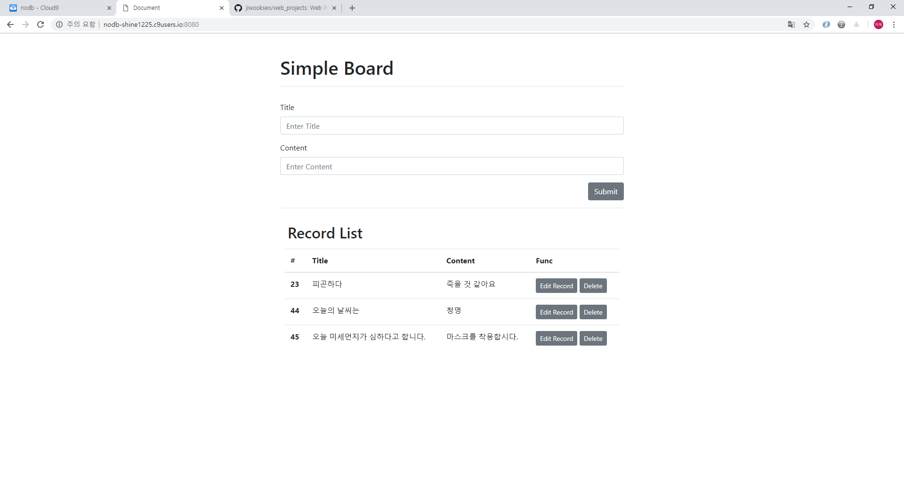
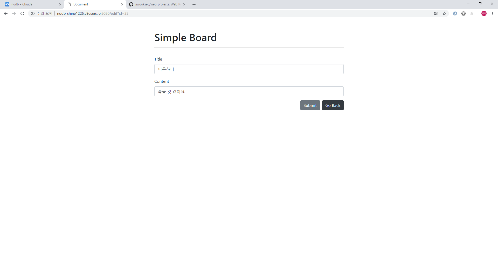

# Board

* SQLite3 practice by Python, Flask

* Bootstrap practice for board service

## I. 목표

Python 언어를 사용한 SQLite3 DB 관리

Flask, Bootstrap을 이용한 Board Service 구현


## II. 구성

```bash
$ tree
.
|-- README.md
|-- app.py
|-- assets
|   |-- img_0.PNG
|   |-- img_1.PNG
|   `-- img_2.PNG
|-- data
|   `-- board.splite3
`-- templates
    |-- edit.html
    `-- index.html
```

## II. 스펙

SQLite3 DB를 이용한 게시글 관리

* 게시글 작성 및 게시글 리스트 출력 기능

* Record Edit 기능

* Record Delete 기능  

* 모든 기능은 POST request 방식을 사용해 보안성을 높힌다.

* CREATE, UPDATE, DELETE를 마친 후 main page로 redirect 해준다.


## III. 샘플이미지

* main page :

    

* edit page :

    