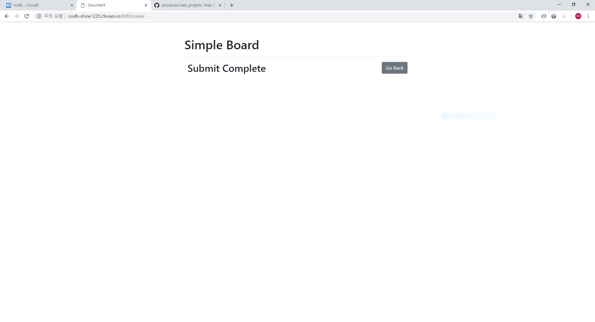

# Board

* SQLite3 practice by Python, Flask

* Bootstrap practice for board service

## I. 목표

Python 언어를 사용한 SQLite3 DB 관리

Flask, Bootstrap을 이용한 Board Service 구현


## II. 구성

```bash
$tree
```

## II. 스펙

SQLite3 DB를 이용한 게시글 관리

* 게시글 작성 및 게시글 리스트 출력 기능

* Record Edit 기능

* Record Delete 기능  


## III. 샘플이미지

* main page :

    

* edit page :

    

* submit, update, delete page :  
문구를 제외한 화면 출력은 같다.

    